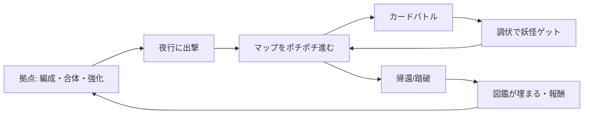

# 企画書:『百鬼調伏録』(ひゃっきちょうぶくろく)※仮題

- 作成日: 2026-07-18
- ステータス: ドラフト v0.1(ベース検証フェーズ向け)
- プラットフォーム: iPhone Safari / PWA(ホーム画面追加)、縦・横両対応
- オンライン要素: なし(完全オフライン単体で完結)

---

## 1. コンセプト

> **「倒す」んじゃない、「配下にする」カードバトル。**

夜の日本を舞台に、プレイヤーは妖怪を調伏(ちょうぶく)して従える術士となる。
道中で出会う妖怪とデッキバトルし、**弱らせてから「調伏札」を切って自分のカードにする**。
捕まえた妖怪はそのままデッキの戦力になり、育成・合体で新たな妖怪を生み出し、百鬼の図鑑を埋めていく。

### 3本柱と企画要件の対応

| 要件 | 本企画での実装 |
|---|---|
| 収集 | 敵妖怪を戦闘中に「調伏」して入手。図鑑100体コンプが長期目標 |
| 成長 | 妖怪のレベルアップ+2体合体「憑合(ひょうごう)」で新種・技継承 |
| バトル | 妖怪カードのデッキバトル。手動ポチポチ/オート(式神代行)切替 |
| 操作 | 全操作タップのみ。ドラッグ・スワイプ・タイミング入力なし |

### 差別化フック(既視感の上に乗せる新味)

1. **調伏システム**: ポケモン的キャプチャをカードバトルに統合。「あと1回殴ると倒しちゃう、今札を切るか?」という毎戦闘の駆け引き
2. **現実時間連動**: 端末時計で昼/夜・月齢を参照し、出現妖怪が変化(満月に出やすくなるレア妖怪など)。サーバー不要でPWAと好相性
3. **持ち帰りローグライト**: ランに失敗しても調伏した妖怪は手元に残る。「負けても図鑑は進む」ので低ストレス

---

## 2. ターゲット・プレイ体験

- **ターゲット**: スキマ時間にスマホで遊びたい層。アクション操作が苦手でも、収集・育成・デッキ構築は好きな人
- **1セッション**: 5〜10分(1ラン=一夜の探索)
- **感情曲線**: 「珍しい妖怪が出た!」→「調伏成功!」→「合体したら何ができる?」→「図鑑があと少し」
- **操作原則**: 片手・親指・タップのみ。縦画面は片手持ち、横画面はカードが見やすい観戦向けレイアウト

---

## 3. コアループ

- 短期ループ(数十秒): カードを選んで戦う → 調伏の判断
- 中期ループ(5〜10分): 一夜のラン → 持ち帰り → 強化・合体
- 長期ループ(週〜月): 図鑑コンプ、深層踏破、レア月齢妖怪の収集

---

## 4. ゲームシステム詳細

### 4.1 バトル(デッキ構築ターン制)

- デッキ: 妖怪カード最大20枚で編成
- 手札4枚、毎ターン1枚ドロー。霊力(コスト)は毎ターン回復+成長
- **操作は「カードをタップ → 対象をタップ」の2タップのみ**(単体対象が自明なら1タップ)
- 属性は五行(木・火・土・金・水)の相性じゃんけん。有利属性で調伏成功率も上がる
- 妖怪カードは「攻撃/守り/妙技(特殊効果)」のいずれかの役割を持つ

### 4.2 調伏(収集)

- 敵妖怪のHPを一定以下に削ると「調伏可能」状態(見た目で明示)
- 手札の**調伏札**をタップして調伏試行。成功率は残HP・属性相性・札の格で変動
- 失敗すると敵が怒り強化 → リスクリターンの駆け引き
- 倒し切ると素材のみ入手(調伏はできない)。「倒すか従えるか」を毎回選ぶ

### 4.3 成長

- **レベル**: 戦闘参加で経験値。数値成長
- **憑合(合体)**: 2体を合体させ、新種を生成 or 上位種へ。技を1つ継承可能
  - 組み合わせ発見が図鑑埋めの主動線(「河童×鬼火=?」)
- **呪具**: ランで拾う装備品。妖怪1体に1つ

### 4.4 ラン構造(夜行)

- ノード選択式マップ(分岐をタップで選ぶ)。戦闘/宝/茶屋(回復)/選択イベント/主(ボス)
- 1ラン10〜15ノード程度
- 敗北してもその夜に調伏した妖怪と素材の半分は持ち帰り

### 4.5 オートバトル(式神代行)

- ステージを一度手動クリアすると、そのステージの**オート周回**が解放
- オート時は倍速・スキップあり。素材集め・レベリング用
- 調伏はオートでは発生しない(レア確保は手動で、という住み分け)

### 4.6 現実時間連動

- 端末時刻で「昼/夕/夜/深夜」、日付から擬似月齢を算出
- 時間帯・月齢で出現テーブルが変化。図鑑に「出現条件」としてヒント表示
- 完全ローカルで動作。時刻改変対策は行わず、端末時刻を変えても警告・痕跡・ペナルティなし(オフライン単体の遊び方を制限しない)

---

## 5. 画面構成

| 画面 | 内容 |
|---|---|
| 拠点(ホーム) | 出撃・図鑑・編成・憑合・強化への導線。時間帯で背景が変わる |
| 図鑑 | 100体のシルエット図鑑。出現条件・憑合レシピのヒント |
| 編成 | デッキ20枚の編集。おすすめ編成ボタン |
| 夜行マップ | ノード分岐をタップ選択 |
| バトル | 手札4枚+敵最大3体。縦: 手札下部/横: 手札右側 |
| 憑合 | 2体選択 → 結果プレビュー → 実行 |

縦横対応方針: レイアウトはFlexbox/Gridで組み、縦=上下分割・横=左右分割に切り替えるのみ。ゲームロジックは共通。

---

## 6. 初期検証計画(履歴)

この節は企画開始時の判定基準を残した履歴である。現在のRC10は、調伏・憑合54通りを中核に、妖怪55種、3ダンジョン、最終試練、時間・月齢、実績、進行解放、PWA、JSONバックアップ、出撃ファースト拠点、全妖怪・ボスと統一した夜行タイトルまで実装済み。

**当初の目的**: 「調伏の駆け引き+憑合の発見」がポチポチ操作で面白いかを最小コストで確認する。

### 当初のMVP(検証版)スコープ

- 妖怪15種(絵はプレースホルダー/絵文字でよい)
- 1ダンジョン・10ノード・ボス1体
- バトル・調伏・憑合(レシピ10通り)・レベルのみ
- オート・呪具・時間連動・図鑑UIは**入れない**
- セーブはlocalStorageで仮実装

### 検証の合格基準

1. 1ランを「もう一回」と思って3周以上したくなるか
2. 調伏の「今切るか」の判断が毎回発生しているか(作業化していないか)
3. 憑合の結果を見たくて素材妖怪を集めに行く動機が生まれるか

→ 合格なら本制作(キャラデザイン発注・図鑑100体設計)へ。不合格なら調伏/憑合の仕様を1回だけ作り直して再判定。

### フェーズ実績

| フェーズ | 内容 |
|---|---|
| P1 本制作α | 完了。妖怪50体、3ダンジョン、オート、呪具、図鑑UIを実装。セーブは引継ぎ可能なlocalStorageを継続採用 |
| P2 β | 完了。時間・月齢、実績、進行解放、最終試練、全妖怪・ボスイラストを実装。100体化はRC10範囲外 |
| P3 リリース | RC10ローカル実装完了。PWA、Service Worker、ホーム画面対応、全画面UI、JSONバックアップ、憑合拡張、出撃ファースト拠点、統一済みタイトルとキャラクターアートを実装。公開先・iPhone確認待ち |

---

## 7. 技術方針(概要)

- ビルド不要のJavaScript(classic script)+DOM+CSS。軽量さとGitHub Pagesでの保守性を優先し、RC10ではフレームワークを導入しない
- PWA: Service Workerで全アセットキャッシュ、機内モードでも起動可能
- セーブ: localStorage+引継ぎコード+JSONバックアップ。ラン途中復元と旧版データ移行を備え、RC10ではIndexedDB移行を行わない
- アセットは軽量(ドット絵 or 1枚絵PNG/WebP)。通常SafariのITP制限と端末側のデータ削除を考慮し、セーブのエクスポート機能を必須とする

---

## 8. リスクと対策

| リスク | 対策 |
|---|---|
| 調伏が「毎回やるだけの作業」になる | 倒し切り(素材)と調伏(戦力)の報酬を排他にし、選択を強制する |
| iOSの端末変更・容量不足・Webサイトデータ削除 | ホーム画面PWAはITPの7日制限対象外。引継ぎコードとJSONファイルのエクスポート/インポートを用意 |
| 図鑑100体のアセット量 | 検証合格までプレースホルダーで一切描かない |
| オートバトルで手動の意味が消える | 調伏は手動限定にして役割分担 |

---

## 9. タイトル案

- 百鬼調伏録(ひゃっきちょうぶくろく)
- あやかし夜行
- 調伏師とカードの夜

## 付録: ボツ案(方向性の比較用)

- **式神工房**: 素材収集→式神クラフト→性能試験バトル。クラフト深度は出るが、収集とバトルの距離が遠い
- **妖怪茶屋**: 昼は放置経営・夜はバトル。二毛作は魅力だが検証すべきコアが2つになり、初期スコープが重い
